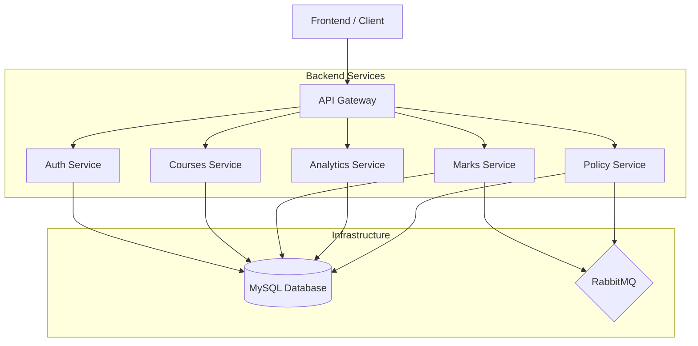

# System Architecture

The Grading Management System (GMS) is built using a modern microservices architecture, emphasizing scalability, maintainability, and clear separation of concerns.

## Overview

The system is composed of several independent microservices that communicate via REST APIs and asynchronous messaging. The frontend is a Next.js application that interacts with the backend services through a central API Gateway.

## Component Breakdown

### 1. API Gateway (`gateway`)
- **Technology**: FastAPI (Python)
- **Responsibility**: Entry point for all external requests.
- **Features**:
    - **Routing**: Proxies requests to internal microservices.
    - **Authentication**: Validates JWT tokens before forwarding requests.
    - **Rate Limiting**: Protects services from excessive traffic.
    - **CORS**: Handles Cross-Origin Resource Sharing.

### 2. Auth Service (`auth_user`)
- **Technology**: FastAPI (Python)
- **Responsibility**: Manages user accounts, authentication (Google Login / Local), and profile management.
- **Data**: Stores user credentials, roles, and profile details.

### 3. Courses Service (`courses`)
- **Technology**: FastAPI (Python)
- **Responsibility**: Manages the lifecycle of courses, student enrollments, and teaching assistant assignments.
- **Features**: Course creation, enrollment management, role-based access within courses.

### 4. Marks Service (`marks`)
- **Technology**: FastAPI (Python)
- **Responsibility**: Handles student marks, assessments, and grading logic.
- **Integration**: Communicates with the Policy service to ensure grading adheres to set rules.

### 5. Analytics Service (`analytics`)
- **Technology**: FastAPI (Python)
- **Responsibility**: Processes data from Marks and Courses to provide visual insights and performance reports.

### 6. Policy Service (`policy`)
- **Technology**: FastAPI (Python)
- **Responsibility**: Manages grading policies, weightage for different assessment categories, and course-specific rules.

## Communication Patterns

- **Synchronous**: Most inter-service communication initiated by the Gateway happens over HTTP using RESTful APIs.
- **Asynchronous**: Long-running tasks or events (like sending notification emails) are handled via RabbitMQ to ensure the system remains responsive.

## Deployment Architecture

- **Containerization**: Every service and infrastructure component is containerized using **Docker**.
- **Orchestration**: The system is designed to run on **Kubernetes (K8s)**.
- **Ingress**: Traffic routing is managed by two Ingress resources:
    - **`gateway-ingress`**: Routes requests to `/api/*` to the **Gateway** and strips the prefix.
    - **`frontend-ingress`**: Routes all other requests to the **Frontend**.
- **Storage**: Persistent Volumes (PV) and Claims (PVC) are used for MySQL data persistence.
